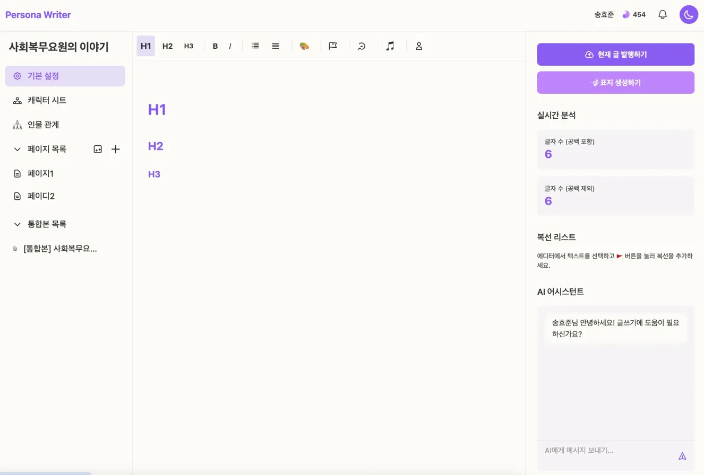

# 📚 Persona Writer

> AI 기반 창작 글쓰기 플랫폼 - 당신의 이야기를 더 특별하게

[](https://persona-writer.vercel.app/)
[](https://reactjs.org/)
[](https://www.typescriptlang.org/)
[](https://supabase.com/)
[](https://ai.google.dev/)

**Persona Writer**는 AI 기반의 차세대 글쓰기 플랫폼입니다. 작가들이 체계적으로 세계관을 구축하고, 매력적인 캐릭터를 창조하며, 일관성 있는 스토리를 완성할 수 있도록 돕습니다.

🚀 **[Live Demo 바로가기](https://persona-writer.vercel.app/)**

---

## ✨ 주요 기능

### 📝 강력한 에디터 시스템
- **TipTap 기반 리치 에디터**: 마크다운 지원, 다양한 서식, 코드 블록
- **자동 저장**: 500ms 디바운스로 안전한 실시간 저장
- **전체화면 모드**: 집중 모드로 몰입도 높은 글쓰기 (F11 단축키)
- **복선 관리**: 텍스트 선택으로 복선 등록 및 추적

### 🤖 AI 어시스턴트 (Google Gemini)
- **실시간 글쓰기 도움**: 문체 분석, 캐릭터 일관성 체크
- **빠른 프롬프트**: 자주 쓰는 명령어 원클릭 실행
- **컨텍스트 기반 제안**: 현재 작성 중인 내용 기반 조언

### 👥 캐릭터 관리
- **캐릭터 시트**: 이름, 성별, 성격, 상세 설명 관리
- **인물 관계도**: React Flow 기반 시각적 관계 표현
- **캐릭터 아크**: 성장/변화 추적, 감정 상태 기록
- **드래그앤드롭**: 직관적인 순서 조정

### 📊 스토리 구조화 도구
- **플롯 보드**: Kanban 스타일 (할 일 / 진행 중 / 완료)
  - 드래그앤드롭으로 카드 이동
  - 실시간 시각적 피드백
  - 컬럼별 카드 관리
- **타임라인**: 시간순 사건 정리 및 관리
- **페이지 관리**: 드래그앤드롭 정렬, 챕터별 구성
- **통합본 생성**: 여러 페이지를 하나로 병합

### 🎨 창작 도구
- **AI 표지 생성**: 작품 내용 기반 표지 이미지 생성
- **다크 모드**: 눈의 피로를 줄이는 다크 테마
- **EPUB 내보내기**: 완성작을 전자책 형식으로 다운로드

### 🌐 커뮤니티 & 발행
- **이야기 광장**: 다른 작가들의 작품 감상
  - 장르 필터 (로맨스, 판타지, SF, 미스터리 등)
  - 정렬 (신작순, 인기순)
  - 검색 기능
- **작품 발행**: 무료/유료(300-500원) 선택 가능
- **좋아요 & 댓글**: 작품에 대한 반응 공유
- **영감 시스템**:
  - 일일 로그인 보상 (10 영감)
  - 유료 작품 구매 (14일 열람권)
  - 영감 충전 (100개 = 1,000원)

### 🔔 사용자 경험
- **실시간 알림**: 좋아요, 댓글, 시스템 알림
  - 카테고리별 탭 분류
  - 읽음/안 읽음 상태 관리
- **프로필 페이지**: 작가별 작품 모아보기
- **반응형 디자인**: 모바일, 태블릿, 데스크톱 지원
- **로딩 인디케이터**: 프로그레스 바와 스피너로 시각적 피드백

---

## 🛠️ 기술 스택

### Frontend
- **React 18.3** - UI 라이브러리
- **TypeScript 5.6** - 타입 안전성
- **Vite** - 빠른 빌드 도구
- **Tailwind CSS** - 유틸리티 우선 스타일링
- **TipTap** - 강력한 WYSIWYG 에디터
- **React Flow** - 노드 기반 관계도
- **@dnd-kit** - 드래그앤드롭 라이브러리
- **JSZip** - EPUB 생성

### Backend
- **Node.js** - 런타임
- **Express** - 웹 프레임워크
- **TypeScript** - 타입 안전성

### Database & Auth
- **Supabase** - PostgreSQL 기반 BaaS
  - Row Level Security (RLS)
  - 실시간 구독
  - Storage (이미지 업로드)

### AI & APIs
- **Google Gemini API** - AI 글쓰기 어시스턴트
- **Iamport** - 결제 시스템 (영감 충전)

---

## 🚀 빠른 시작

### 1. 저장소 클론
```bash
git clone https://github.com/your-username/persona-writer.git
cd persona-writer
```

### 2. 의존성 설치
```bash
npm install
```

### 3. 환경 변수 설정
프로젝트 루트에 `.env` 파일 생성:

```env
# Supabase
VITE_SUPABASE_URL=your_supabase_url
VITE_SUPABASE_ANON_KEY=your_supabase_anon_key
DATABASE_URL=your_database_url
SUPABASE_SERVICE_ROLE_KEY=your_service_role_key

# Google Gemini
GEMINI_API_KEY=your_gemini_api_key

# API URL
VITE_API_URL=http://localhost:3001

# Iamport (결제)
VITE_IAMPORT_IMP_CODE=your_imp_code
VITE_IAMPORT_MERCHANT_UID_PREFIX=persona_writer_
```

### 4. 데이터베이스 설정
Supabase SQL Editor에서 `schema.sql` 실행:
```bash
# Supabase Dashboard > SQL Editor에서 실행
cat schema.sql
```

### 5. 개발 서버 실행
```bash
# 프론트엔드 (http://localhost:5173)
npm run dev

# 백엔드 (http://localhost:3001)
npm run server
```

### 6. 샘플 데이터 추가 (선택)
```bash
# Supabase SQL Editor에서 실행
# 1. sample_data.sql - 10개 프로젝트 생성
# 2. publish_all_stories.sql - 이야기 광장에 발행
```

---

## 📦 빌드 & 배포

### 프로덕션 빌드
```bash
# 프론트엔드 빌드
npm run build

# 백엔드 빌드
npm run build:server
```

### Vercel 배포 (프론트엔드)
1. GitHub 저장소와 연동
2. 환경 변수 설정
3. 자동 배포 완료

### Render 배포 (백엔드)
1. **Build Command**: `npm install && npm run build:server`
2. **Start Command**: `node dist-server/server.js`
3. 환경 변수 설정

---

## 🎯 주요 사용 시나리오

### 📖 소설 작가
1. **프로젝트 생성** → 작품 제목 설정
2. **캐릭터 시트** → 주요 인물 설정
3. **인물 관계도** → 캐릭터 간 관계 시각화
4. **플롯 보드** → 사건 전개 정리
5. **타임라인** → 시간 순서 확인
6. **에디터** → 본문 작성 (AI 도움 받기)
7. **발행** → 이야기 광장에 공유

### 🎬 시나리오 작가
1. **캐릭터 아크** → 캐릭터 성장 추적
2. **타임라인** → 장면 순서 정리
3. **복선 관리** → 복선/회수 체크
4. **통합본** → 전체 시나리오 완성

### ✍️ 에세이 작가
1. **페이지 관리** → 주제별 글 작성
2. **AI 어시스턴트** → 문체 개선
3. **EPUB 다운로드** → 전자책 출간

---

## 🗂️ 프로젝트 구조

```
persona-writer/
├── src/
│   ├── components/         # React 컴포넌트
│   │   ├── layout/         # 레이아웃 컴포넌트
│   │   ├── CharacterSheetEditor.tsx
│   │   ├── CharacterRelationshipManager.tsx
│   │   ├── CharacterArcSection.tsx
│   │   ├── PlotBoard.tsx
│   │   ├── Timeline.tsx
│   │   ├── Editor.tsx
│   │   └── ...
│   ├── context/            # React Context
│   │   ├── AuthContext.tsx
│   │   ├── ProjectContext.tsx
│   │   └── EditorContext.tsx
│   ├── pages/              # 페이지 컴포넌트
│   │   ├── HomePage.tsx
│   │   ├── DashboardPage.tsx
│   │   ├── StoryViewerPage.tsx
│   │   └── ...
│   ├── lib/                # 유틸리티 함수
│   │   ├── supabaseClient.ts
│   │   ├── epubGenerator.ts
│   │   └── utils.ts
│   └── data/               # 타입 정의
├── server/                 # 백엔드 서버
│   └── server.ts
├── schema.sql              # 데이터베이스 스키마
├── sample_data.sql         # 샘플 데이터
└── publish_all_stories.sql # 샘플 발행 글
```

---

## 🤝 기여하기

기여는 언제나 환영합니다! 다음 절차를 따라주세요:

1. Fork the Project
2. Create your Feature Branch (`git checkout -b feature/AmazingFeature`)
3. Commit your Changes (`git commit -m 'Add some AmazingFeature'`)
4. Push to the Branch (`git push origin feature/AmazingFeature`)
5. Open a Pull Request

---

## 📝 라이선스

This project is licensed under the MIT License.

---

## 👨‍💻 개발자

**Hyojun Song**
- Email: [your-email@example.com]
- GitHub: [@your-username](https://github.com/your-username)

---

## 🙏 감사의 말

- [React](https://reactjs.org/)
- [TipTap](https://tiptap.dev/)
- [Supabase](https://supabase.com/)
- [Google Gemini](https://ai.google.dev/)
- [Tailwind CSS](https://tailwindcss.com/)
- [Vite](https://vitejs.dev/)

---

## 📸 스크린샷

### 메인 화면


### 작품 편집


### 캐릭터 관계도


### 이야기 광장


---

<div align="center">

**Made with ❤️ by Persona Writer Team**

[🌟 Star this repo](https://github.com/your-username/persona-writer) | [🐛 Report Bug](https://github.com/your-username/persona-writer/issues) | [💡 Request Feature](https://github.com/your-username/persona-writer/issues)

</div>
