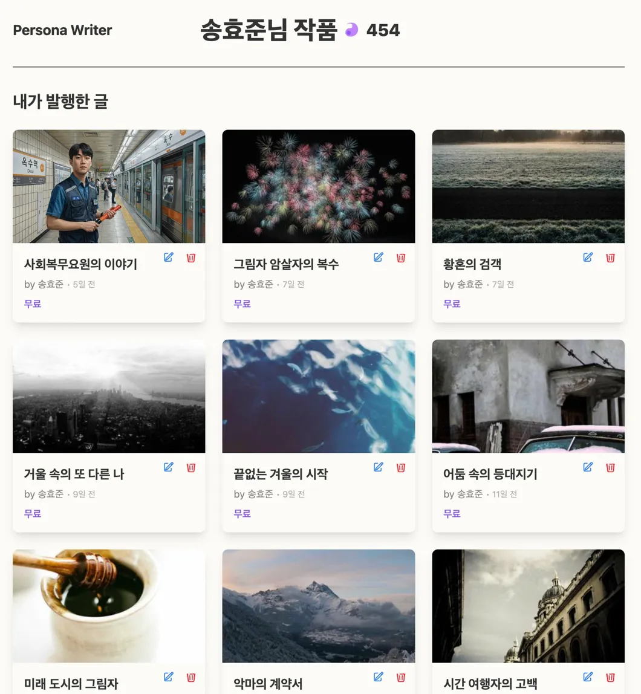
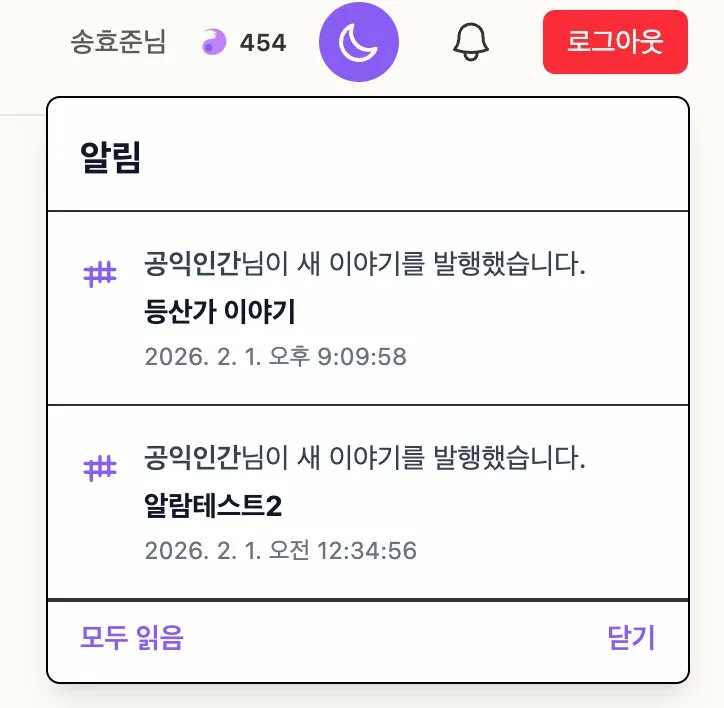

참고사항!!
     

📱 전체적인 인상
👍 잘된 점:

UI/UX가 깔끔하고 현대적임 (보라색 브랜딩 일관성 있음)
다크모드 지원 👌
작품 카드 레이아웃이 깔끔하고 시각적
AI 어시스턴트 기능이 실제로 구현되어 있음
페이지 목록 관리 기능이 체계적

😐 아쉬운 점:

기능은 많은데 사용자가 어떻게 시작해야 할지 모호함
일부 UI 요소들이 설명 없이 배치됨
커뮤니티 기능이 약함

🎯 화면별 상세 피드백
1. 이야기 광장 (첫 번째 이미지)
개선 사항:

필터 기능 보강

현재: 신작순/인기순만 있음
추가: 장르 필터 (로맨스, 판타지, SF, 미스터리, 에세이 등)
추가: 길이 필터 (단편/중편/장편)
추가: 완결 여부 필터

카드 정보 추가

현재: 제목, 작가, 날짜, 좋아요만 표시
추가: 조회수 표시 (예: 👁️ 1,234)
추가: 댓글 수 표시 (예: 💬 56)
추가: 짧은 소개글 (2-3줄) - 현재는 제목만으로 내용 파악 불가
추가: 장르 태그 (예: #로맨스 #일상)
추가: 읽는 시간 표시 (예: ⏱️ 약 5분)

"10일 담음" 뱃지

좋은 아이디어인데 뱃지 디자인이 살짝 촌스러움
제안: 더 세련된 아이콘으로 교체 (예: 🔥 HOT, ⭐ NEW)

썸네일 이미지

현재는 커버 이미지 비율이 제각각
제안: 고정 비율 (16:9 또는 4:3) 강제해서 통일감 있게

인터랙션 부재

현재: 카드 클릭하면 작품으로 이동만 가능할 듯
추가: 카드 호버 시 미리보기 툴팁 (첫 문단 보여주기)
추가: 빠른 액션 버튼 (북마크, 공유)

2. 제작자의 추천 (두 번째 이미지)
개선 사항:

추천 알고리즘 투명성

현재: "매주 새로운 영감을 주는 작품들을 소개합니다" - 너무 추상적
변경: "당신이 좋아요 누른 작품 기반 추천" 또는 "이 작가들이 주목받고 있어요" 같이 구체적으로

책 표지 디자인

시각적으로 예쁨! 하지만 클릭 유도 요소 부족
추가: 표지 위에 호버 시 "지금 읽기" CTA 버튼
추가: 평점 표시 (⭐ 4.8/5.0)

소개글이 너무 김

현재: 긴 인용구로 소개
제안: 첫 2-3줄만 보여주고 "더보기" 버튼
제안: 또는 핵심 키워드만 추출 ("사랑, 후회, 시간여행")

페이지네이션

"이전 / 페이지 1/2 / 다음" - 디자인이 밋밋함
제안: 점(dot) 스타일 인디케이터 추가
제안: 스와이프 제스처 지원 (모바일)

추천 빈도 표시 부재

사용자가 언제 새 추천이 올라오는지 모름
추가: "매주 토요일 업데이트" 같은 스케줄 표시

3. 송효준님 작품 목록 (세 번째 이미지)
개선 사항:

"+ 새 작품 시작하기" 버튼

현재: 점선 박스로만 표시
개선: 더 눈에 띄는 디자인 (아이콘 + 텍스트)
개선: 클릭 시 템플릿 선택 모달 띄우기

작품 카드에 상태 표시 없음

추가: "작성중", "완료", "비공개" 등 상태 뱃지
추가: 진행률 표시 (예: 85% 완성)

정렬/필터 옵션 부재

추가: 최근 수정순, 생성순, 인기순 정렬
추가: 폴더 기능 (예: "진행중", "완료", "아이디어")

편집/삭제 버튼 위치

현재: 카드 상단에 배치
제안: 호버 시에만 나타나게 해서 깔끔함 유지
또는: 카드 우클릭 메뉴로 처리

통계 정보 부족

추가: 총 단어 수 표시
추가: 마지막 수정 일시
추가: 조회수/좋아요 (공개 작품의 경우)

4. 송효준님 프로필 (네 번째 이미지)
개선 사항:

작품 그리드 레이아웃

현재: 3열 그리드 - 좋음!
개선: 카드 크기가 약간 작아서 썸네일 가독성 떨어짐
제안: 2열 레이아웃도 선택 가능하게 (더 큰 카드)

작가 정보 부재

현재: "송효준님 작품" 제목만 있음
추가: 프로필 사진, 간단한 소개글
추가: 팔로워/팔로잉 수
추가: 작품 수, 총 조회수 등 통계

필터/정렬 없음

작품이 많아지면 찾기 힘들 것
추가: "공개작/비공개작" 필터
추가: "인기순/최신순" 정렬

CTA 부재

타인이 이 페이지를 볼 때: "팔로우" 버튼 필요
본인이 볼 때: "새 작품 쓰기" 버튼이 눈에 더 띄어야 함

5. 알림 패널 (다섯 번째 이미지)
개선 사항:

알림 카테고리 구분 없음

현재: 모든 알림이 섞여 있음
추가: 탭으로 구분 (전체 / 좋아요 / 댓글 / 시스템)

알림 내용이 너무 간단

현재: "공익인간님이 새 이야기를 발행했습니다"
개선: 작품 제목도 같이 보여주기
개선: 썸네일 추가

액션 부재

현재: 클릭하면 해당 작품으로 이동만 가능할 듯
추가: 알림에서 바로 "좋아요" 또는 "북마크" 가능하게

읽음/안읽음 구분 불명확

추가: 읽지 않은 알림에 점(•) 표시
추가: "모두 읽음 처리" 버튼

시간 표시 개선

현재: "2026. 2. 1. 오후 9:09:58" - 너무 상세함
변경: "2시간 전", "어제", "1주일 전" 같은 상대 시간

6. 작품 편집 화면 (여섯 번째 이미지)
개선 사항:
A. 왼쪽 사이드바

구조가 혼란스러움

"기본 설정" 아래에 "캐릭터 시트", "인물 관계" 있는데
"페이지 목록", "통합본 목록"과 계층이 명확하지 않음
제안: 명확한 섹션 구분

     📋 작품 설정
       - 기본 정보
       - 캐릭터 시트
       - 인물 관계
     
     📄 콘텐츠
       - 페이지 목록
       - 통합본 목록
     
     📊 통계

"통합본 목록"이 뭔지 모호

사용자가 이게 뭔지 바로 이해 못할 수 있음
제안: 툴팁 추가 또는 "챕터 묶음" 같은 더 직관적 이름

페이지 추가 버튼 위치

"페이지 목록" 옆 + 버튼 - 좋음!
추가: 드래그앤드롭으로 페이지 순서 변경 가능하게

B. 중앙 편집기

텍스트 에디터 기능 부족

현재: H1/H2/H3, 굵게, 기울임, 리스트 정도만 보임
추가 필요:

글자색/배경색
인용구 스타일
코드 블록 (기술 글 작성 시)
표 삽입
링크 삽입
구분선
체크박스

이미지 삽입 방식 불명확

아이콘은 있는데 어떻게 작동하는지 모름
제안: 드래그앤드롭 지원 강조
제안: 이미지 캡션 기능

저장 상태 표시 없음

자동저장 되는지? 수동저장인지?
추가: 상단에 "마지막 저장: 2분 전" 표시
추가: 저장 중일 때 로딩 인디케이터

전체화면 모드 없음

집중해서 쓸 수 있는 "집중 모드" 필요
추가: F11 또는 버튼으로 전체화면 전환

단어 수 카운터 위치

우측 하단 구석에 있는 것 같은데 더 눈에 띄게
제안: 하단 중앙 상태바에 고정

C. 우측 사이드바

"현재 글 발행하기" 버튼 위치 애매

너무 위에 있어서 실수로 누를 수 있음
제안: 하단으로 이동 또는 확인 모달 추가

"표지 생성하기" 버튼

좋은 기능! 하지만 어떻게 작동하는지 설명 없음
추가: "AI가 내용 기반으로 표지 생성" 같은 툴팁

실시간 분석

"글자 수 (공백 포함)" / "글자 수 (공백 제외)" - 좋음!
추가: 예상 읽기 시간 (예: "약 3분 소요")
추가: 문단 수
추가: 평균 문장 길이

AI 어시스턴트 UI 개선

현재: 질문 입력칸만 있음
추가: 자주 쓰는 프롬프트 버튼

"다음 전개 제안해줘"
"이 문장 더 나은 표현으로 바꿔줘"
"오타 체크해줘"
"감정 묘사 추가해줘"

추가: AI 응답 히스토리 (이전 대화 보기)

복선 리스트

"에디터에서 텍스트를 선택하면..." - 좋은 기능인데 설명이 너무 작음
개선: 처음 쓰는 사람을 위한 온보딩 툴팁
추가: 복선에 색상 태그 (빨강: 중요, 노랑: 힌트 등)

🚀 추가하면 좋을 전혀 새로운 기능들
1. 작품 관리 기능

버전 히스토리: 깃허브처럼 이전 버전으로 되돌리기
공동 집필: 여러 작가가 함께 쓰기 (Google Docs 스타일)
댓글/피드백 시스템: 특정 문단에 독자/베타리더가 댓글 남기기

2. 글쓰기 도구

플롯 보드: 트렐로처럼 카드 형식으로 사건 정리
타임라인 뷰: 스토리 사건을 시간순으로 시각화
캐릭터 아크 트래커: 캐릭터 성장/변화 추적
감정 그래프: 스토리의 감정 기복을 그래프로 표시

3. AI 기능 강화

스타일 전환: "김영하 스타일로", "헤밍웨이 스타일로" 변환
플롯홀 탐지: AI가 모순이나 앞뒤 안 맞는 부분 찾아줌
캐릭터 일관성 체크: 캐릭터가 성격에 맞지 않게 행동하면 알림
문체 분석: 내 글의 특징 분석 (어휘 수준, 문장 길이, 톤 등)

4. 커뮤니티 기능

베타리더 매칭: 피드백 줄 사람 찾기
글쓰기 챌린지: "30일 연속 쓰기", "단편 대회" 등
작가 스터디: 같은 장르 작가들끼리 모임
릴레이 소설: 여러 작가가 이어쓰기

5. 수익화/동기부여

작품 판매: 유료 전환 옵션
후원 시스템: 독자가 작가에게 커피 사주기
업적 시스템: 뱃지 수집 (첫 작품 완성, 10,000자 돌파 등)
글쓰기 통계: 주간/월간 글쓰기 패턴 분석

6. 내보내기/공유

EPUB/PDF 생성: 전자책 형식으로 내보내기
소셜 공유 최적화: 인스타그램/트위터용 이미지 카드 자동 생성
출판사 연동: 출판 제안 받기

7. 모바일 앱 기능

음성 입력: 말하면 텍스트로 변환
오프라인 모드: 인터넷 없이도 글쓰기
위젯: 홈화면에 글자 수/목표 진행률 표시

8. 접근성/UX

포모도로 타이머: 25분 쓰고 5분 쉬기
백색소음: 집중력 향상 배경음악
독서 모드: 모바일에서 보기 좋게 자동 포맷
음성 읽기: TTS로 내 글 들어보기

9. 분석/인사이트

독자 행동 분석: 어느 지점에서 이탈하는지
인기 키워드: 현재 트렌딩 주제
장르별 벤치마크: 내 작품 vs 동 장르 평균

🎨 UI/UX 개선 우선순위
🔥 당장 해야 할 것 (High Priority)

작품 카드에 더 많은 정보 (조회수, 댓글수, 장르 태그)
에디터 자동저장 상태 표시
알림 카테고리 분류
프로필 페이지에 작가 정보 추가
AI 어시스턴트 자주 쓰는 프롬프트 버튼

⚡ 중요한 것 (Medium Priority)

장르 필터
버전 히스토리
전체화면 모드
페이지 드래그앤드롭 정렬
에디터 기능 확장 (표, 링크 등)

💡 있으면 좋은 것 (Low Priority)

플롯 보드
타임라인 뷰
포모도로 타이머
캐릭터 아크 트래커
EPUB 내보내기

💬 종합 의견
전체적으로 정말 탄탄하게 만들어진 서비스네요! 특히:

AI 어시스턴트 통합이 자연스러움
페이지 단위 관리가 체계적
복선 리스트 같은 디테일한 기능

다만 초보 작가들에게는 기능이 많아서 어디서부터 시작해야 할지 헷갈릴 수 있어요. 온보딩 튜토리얼이나 샘플 작품을 제공하면 좋을 것 같아요!